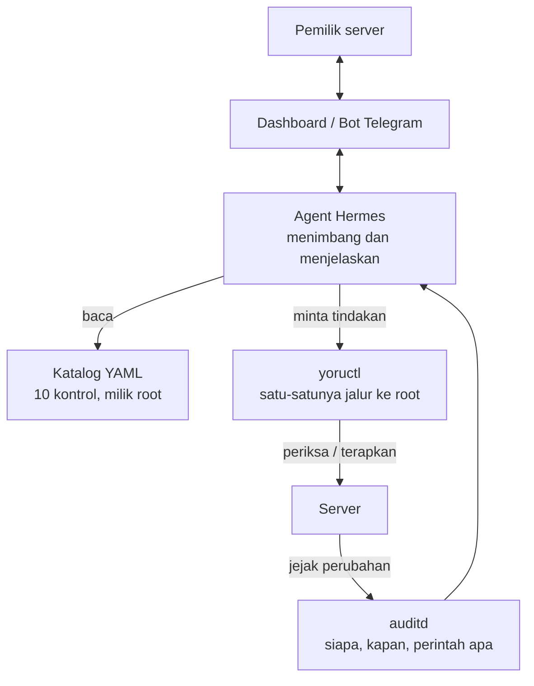

# Yoru

AI agent yang mengeraskan konfigurasi keamanan server, lalu menjaganya tetap
begitu — untuk developer dan UMKM yang tidak punya tim IT.

*Server kamu tidur. Yoru nggak.*

---

## Masalah yang dikejar

Kebanyakan server kecil dipasang sekali, lalu ditinggal. Bukan karena
pemiliknya malas, tapi karena tidak ada yang mengurus: tidak ada tim IT,
tidak ada waktu, dan istilahnya terlalu asing untuk dipelajari sambil jalan.

Yoru mengambil pekerjaan itu. Dia memeriksa setelan keamanan server, minta
izin sebelum mengubah apa pun yang berisiko, memperbaikinya, lalu tiap hari
mengecek apakah masih seperti yang disepakati.

---

## Cara kerja



Pembagian tugasnya sengaja tegas.

**Agent yang menimbang.** Kontrol mana dulu, port ini sah atau tidak, perlu
minta izin atau tidak, bagaimana menjelaskannya ke pemilik yang tidak paham
istilah teknis.

**Katalog yang menyimpan fakta.** Perintah persisnya apa, berkasnya di mana,
bagaimana cara mengembalikannya kalau gagal. Agent tidak boleh mengarang
perintah — kalau kontrolnya tidak ada di katalog, jawabannya "tidak tahu",
bukan menebak.

**`yoructl` yang bertindak.** Satu-satunya jalur agent ke hak root, dan dia
cuma menerima dua argumen: nomor kontrol dan satu dari empat tindakan. Bukan
`bash`, bukan `rm`, bukan `apt`. Kalau suatu hari agentnya salah menimbang
atau kena prompt injection dari isi log yang dia baca sendiri, batas terjauh
yang bisa dia lakukan tetap salah satu dari 40 tindakan yang sudah ditulis
dan diuji manusia.

Setiap kontrol punya empat fungsi: `periksa`, `terapkan`, `kembalikan`,
`verifikasi`. Yang terakhir itu yang paling penting — Yoru tidak pernah
menganggap sebuah kontrol berhasil hanya karena berkasnya berhasil ditulis
dan layanannya reload tanpa error. Dia membaca ulang keadaan yang
benar-benar aktif.

---

## Kontrol yang tersedia

| | Kontrol | Risiko | CIS Ubuntu 24.04 v1.0.0 |
|---|---|---|---|
| `K01` | Root tidak bisa login lewat SSH | BERISIKO | 5.1.20 |
| `K02` | Login pakai password dimatikan (SSH key saja) | BERISIKO | — tidak ada di CIS |
| `K03` | Batasi percobaan login SSH | AMAN | 5.1.16, 5.1.13 |
| `K04` | Buang algoritma kripto yang lemah di SSH | BERISIKO | 5.1.6, 5.1.15, 5.1.12 |
| `K05` | Firewall aktif, tolak semua koneksi masuk | BERISIKO | 4.2.1, 4.2.3, 4.2.7 |
| `K06` | Cuma port yang dipakai yang boleh terbuka | BERISIKO | 2.1.22 (sebagian) |
| `K07` | Pembaruan keamanan otomatis | AMAN | 1.2.2.1 (sebagian) |
| `K08` | Jejak audit aktif (auditd) | AMAN | — Level 2, bukan L1 |
| `K09` | Log tersimpan permanen dan tidak membanjiri disk | AMAN | 6.1.2.4, 6.1.2.3, 6.1.1.3 |
| `K10` | Setelan kernel jaringan | AMAN | 3.3.3–3.3.6, 3.3.8–3.3.11 |

Nomor CIS di atas dicocokkan satu per satu ke berkas audit
`CIS_Ubuntu_Linux_24.04_LTS_v1.0.0_L1_Server` terbitan Tenable, bukan ke PDF
CIS aslinya — jadi kami menulisnya begitu, bukan "sesuai CIS".

Tiga baris yang tidak berisi nomor juga sengaja ditulis apa adanya. **K02
tidak ada padanannya di CIS**: seluruh bagian SSH sudah diperiksa dan tidak
ada satu pun rekomendasi tentang mematikan login password. Itu pilihan kami,
karena sasaran Yoru satu server milik satu orang, bukan armada perusahaan
yang belum tentu bisa pakai kunci SSH di semua mesin. **K08 ada di CIS Level
2**, bukan Level 1 — jadi menyertakannya di paket dasar itu kelebihan, bukan
kekurangan. Dan yang bertanda *sebagian* memang belum menutup seluruh isi
item CIS-nya.

**AMAN** berarti Yoru boleh menjalankannya sendiri. **BERISIKO** berarti dia
harus minta izin per item, dan menampilkan dulu apa yang bisa rusak sebelum
tombol setuju bisa ditekan.

Setiap kontrol dijalankan manual dan rollbacknya diuji sungguhan sebelum
masuk katalog. Bukan disalin dari checklist. Kolom `rollback_teruji` di tiap
berkas YAML itu janji, bukan hiasan.

Dan janji itu diuji dua kali, lewat dua jalur yang berbeda. Sepuluh kontrol
dikali empat fungsi berarti 40 tindakan — keempat puluhnya sudah pernah
benar-benar dijalankan lewat `yoructl`, bukan cuma lewat tangan. Itu bukan
formalitas: dari situ ketemu empat bug yang tidak akan pernah muncul kalau
kami hanya menjalankan `periksa`. Salah satunya membuat K02 tidak pernah bisa
diterapkan sama sekali — dan cara gagalnya berupa penolakan yang terdengar
bijaksana, jenis kerusakan yang paling sulit dicurigai. Ceritanya lengkap ada
di `catalog/K02.yaml`.

---

## Cara pasang

### Yang perlu disiapkan

Server atau VM dengan **Ubuntu Server 24.04**, dan akun biasa yang punya
akses `sudo`. Bukan root — Yoru justru perlu tahu siapa manusia pemilik
servernya.

Sebaiknya kunci SSH kamu sudah terpasang dan sudah pernah dipakai login.
Kalau belum, pemasangan tetap jalan, cuma nanti K02 akan menolak berjalan
sampai kuncinya ada. Itu memang disengaja — K02 mematikan login password,
dan tanpa kunci yang terbukti bekerja, itu sama saja menutup satu-satunya
pintu masuk kamu sendiri.

Kalau ini VM buat coba-coba, ambil snapshot dulu. Bukan karena pemasangannya
berbahaya, tapi karena enak bisa balik ke titik nol kapan pun.

### Pasang

```bash
git clone https://github.com/Godzilla129/yoruAgent.git
cd yoruAgent
sudo bash install.sh
```

Pemasangnya cuma menanyakan dua hal: token bot Telegram dan alamat
dashboard. Dua-duanya boleh dikosongkan dan diisi belakangan di
`/etc/yoru/yoru.conf`. Yang rahasia diketik tanpa ditampilkan di layar, dan
tidak pernah lewat argumen perintah, karena argumen kelihatan oleh siapa pun
yang sedang login dan tersimpan di riwayat shell.

Kunci API model AI **tidak** ditanyakan, dan itu disengaja. Yang memanggil
model itu Hermes, bukan Yoru — Yoru tidak pernah bicara ke model sama sekali.
Jadi kuncinya tinggal di konfigurasi Hermes, satu tempat saja. Menyimpannya
di dua tempat berarti dua tempat yang bisa bocor, dan dua tempat yang bisa
beda isinya tanpa ada yang sadar.

Kalau kamu memasangnya lewat skrip otomatis, pakai `--tanpa-tanya`. Yoru
akan membuat berkas konfigurasi kosong dan memberitahu bahwa isinya harus
dilengkapi.

Kalau kamu perhatikan, tidak ada cara pasang model `curl ... | sudo bash`.
Itu memang lebih ringkas, tapi ini alat keamanan — menyuruh orang
menyalurkan skrip dari internet langsung ke `sudo bash` persis kebiasaan
yang mau kami berantas. Unduh dulu, kalau mau baca dulu, baru jalankan.

### Yang akan kamu lihat

Pemasangan berjalan bertahap, tiap langkah menulis `ok`. Di bagian akhir ada
**Menguji hasil pemasangan** — di situ installer menguji kerjanya sendiri:

```
ok   agent bisa meminta tindakan yang sah
ok   agent ditolak saat mencoba perintah lain
ok   dispatcher menolak jalan saat dirinya sendiri bisa ditulis
ok   dispatcher kembali normal setelah izin dipulihkan
ok   penjagaan menolak berjalan sebagai root
ok   timer penjagaan terdaftar di systemd
```

Kalau salah satu gagal, pemasangan berhenti dan menyebutkan gagal di mana.
Installer ini sengaja tidak akan bilang "selesai" sebelum terbukti jalan.

Aman dijalankan berkali-kali. Yang sudah ada dilewati, bukan dibuat ulang.

### Coba lihat hasilnya

```bash
sudo -u yoru-agent sudo -n /opt/yoru/bin/yoructl K01 periksa
```

Keluarnya satu baris JSON — itu bentuk yang dibaca dashboard dan dikirim ke
Telegram. Ganti `K01` dengan `K02` sampai `K10` untuk kontrol lain.

Coba juga yang ini:

```bash
sudo -u yoru-agent sudo -n id
```

Ditolak. Itu inti desainnya, dan lebih enak dilihat sendiri daripada
dipercaya begitu saja.

### Mana yang aman dicoba, mana yang tidak

```bash
yoructl K01 periksa       # cuma baca. aman di server mana pun
yoructl K01 terapkan      # mengubah setelan. snapshot dulu
yoructl K01 kembalikan    # mengembalikan
```

`periksa` tidak menyentuh apa pun, jadi bebas dicoba termasuk di server yang
sedang dipakai. `terapkan` mengubah setelan sungguhan — ambil snapshot dulu,
dan baca bagian `yang_rusak_kalau_diterapkan` di berkas katalognya.

> **Jangan jalankan `yoructl K05 terapkan` di server yang ada aaPanel atau
> CyberPanel.** K05 menyalakan firewall dan hanya membuka port 22, jadi panel
> di port 8888 atau 8090 langsung tidak bisa diakses. Peringatannya ada di
> `catalog/K05.yaml`, tapi dispatcher belum memaksa memeriksanya — untuk
> sekarang manusianya yang harus tahu.

### Mencopot

```bash
sudo bash install.sh --copot
```

Menghapus dispatcher, katalog, aturan sudoers, dan pengguna agent. Catatan
tindakan di `/var/log/yoru` sengaja ditinggalkan — itu jejak audit, dan alat
keamanan tidak menghapus jejaknya sendiri diam-diam.

Perlu diingat: mencopot **tidak** mengembalikan kontrol yang sudah kamu
terapkan. Kalau mau server kembali seperti semula, jalankan `kembalikan`
untuk tiap kontrol dulu, baru copot.

---

## Isi repo

```
bin/            dispatcher yoructl, pembungkus penjagaan, aturan sudoers
catalog/        10 kontrol keamanan, satu berkas YAML per kontrol
contract/       bentuk data laporan JSON
systemd/        unit dan timer untuk siklus penjagaan harian
examples/       contoh laporan dan contoh berkas konfigurasi
install.sh      pemasang, sekalian menguji hasilnya sendiri
check-all.sh    periksa 10 kontrol sekaligus
```

Setelah terpasang, berkas-berkasnya duduk di sini:

```
/opt/yoru/bin/              dispatcher dan pembungkus, milik root
/usr/share/yoru/catalog/    katalog, milik root - agent cuma boleh membaca
/etc/yoru/yoru.conf         konfigurasi, root:yoru-agent 640
/var/log/yoru/tindakan.log  catatan tindakan, milik root - agent TIDAK bisa menulis
/var/lib/yoru/              laporan, milik yoru-agent - satu-satunya yang boleh ditulis agent
```

Pembagian izin itu inti desainnya: agent boleh menulis laporannya sendiri,
tapi tidak boleh menyentuh katalog yang jadi acuannya, dan tidak boleh
menyunting catatan tindakannya sendiri.

---

## Batasan saat ini

Ini masih versi awal. Yang belum ada, ditulis apa adanya:

- **Nomor CIS dicocokkan dari sumber sekunder.** Rujukannya berkas audit
  Tenable untuk CIS Ubuntu 24.04 v1.0.0 L1 Server, bukan PDF CIS aslinya.
  Nomor dan judulnya sama, tapi kami tidak memegang dokumen primernya, dan
  itu ditulis di setiap berkas katalog. Bagian auditd juga belum dicocokkan
  sama sekali karena ada di profil Level 2, dan berkas itu belum kami buka.
- **Satu setelan CIS terlewat di K10: `3.3.2 packet redirect sending`.**
  Yang sudah ditangani cuma `accept_redirects` (server ini *menerima*
  redirect); `send_redirects` (server ini *mengirim* redirect) belum. Baru
  ketahuan waktu penomoran dicocokkan, sehari sebelum deploy, jadi kami
  memilih menuliskannya daripada menambal semalam. Rinciannya di
  `catalog/K10.yaml`.
- **`rp_filter` sengaja tidak diterapkan.** Alasannya ada di
  `catalog/K10.yaml` — singkatnya, menulis `conf.all.rp_filter` saja tidak
  berpengaruh karena kernel memakai nilai maksimum antara `all` dan
  per-kartu, dan mode ketat bisa memutus lalu lintas yang jalurnya tidak
  simetris.
- **Dispatcher belum memaksa memeriksa keberadaan panel** sebelum menerapkan
  K05. Peringatannya sudah ada di katalog, tapi belum jadi penghalang.
- **`kembalikan` pada K05 mengosongkan firewall, bukan memulihkannya.**
  Perintahnya `ufw reset`, jadi aturan yang dipasang sendiri oleh pemilik
  server ikut terhapus. ufw mengarsipkan berkasnya lebih dulu ke
  `/etc/ufw/user.rules.<tanggal>`, jadi datanya tidak hilang — tapi Yoru
  belum memulihkan dari arsip itu. Untuk kontrol ini, "kembalikan" lebih
  tepat dibaca "dikosongkan".
- **Prasyarat K02 hanya memeriksa satu pemilik.** Kalau server dipakai
  beramai-ramai dan ada yang masih login pakai password, K02 tidak akan tahu,
  dan orang itu terkunci di luar begitu kontrolnya diterapkan. Pastikan semua
  yang perlu masuk sudah punya kunci SSH yang pernah dipakai login.
- **Pagu log K09 masih dipatok 500M.** Katalognya sendiri bilang angka itu
  harus dihitung ulang per server. Masuk akal untuk disk 10–100 GB, tidak
  untuk di luar itu.
- Dashboard, bot Telegram, dan kontrol untuk lapisan web sedang dikerjakan.

---
# YORU
Automated VPS protection hook that intercepts system/network events and applies defensive actions (blocking, alerting, or logging) to harden the server against unauthorized access.
