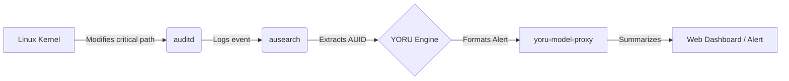

<picture>
  <source media="(prefers-color-scheme: dark)" srcset="assets/banner-dark.svg">
  
</picture>

# YORU: Linux Security Auditing & Forensics

> Lightweight, systemd-managed Linux security auditing designed for AUID forensics and AI-assisted analysis (runtime validation pending).

[](#license)
[](#quick-start)
[](#-validation-status)
[](#-validation-status)


## 🚨 The Incident
It’s 3 AM. Your server's critical configuration was altered. You check the logs, but the actor appears as `root`. Was it an automated script? An attacker? A junior developer who `sudo su`'d into root? You have no idea because the original identity is masked. The forensic trail is gone.

## 💡 Why YORU Exists (The Problem)
* **Forensics Lost After `sudo`:** Standard logging masks the original actor's identity once they switch to root.
* **Alert Fatigue & Noise:** Too many logs make it impossible to separate critical changes from regular system noise.
* **Lack of Context:** Traditional audit logs are cryptic and require deep Linux expertise to interpret.
* **Resource Constraints:** Small teams lack a dedicated Security Operations Center (SOC) to monitor endpoints 24/7.

## 🛠️ The Solution
| The Problem | The YORU Answer |
| --- | --- |
| Forensic trail lost after `sudo` | **AUID Tracking:** YORU is designed to extract the Audit User ID (`auid`), which supports attributing the original actor (runtime validation pending). |
| Alert Noise | **Targeted K08 Rules:** Monitors critical paths. Note: Known false positives like `apt-get` exist; see [RULES.md#known-false-positives](docs/RULES.md#known-false-positives). |
| Cryptic Logs | **Optional AI Proxy & Dashboard:** Designed to summarize auditd events via an LLM proxy with primary + fallback (runtime validation pending). |
| No Dedicated SOC | **Automated Watcher:** Managed via `systemd` timers, acting as a lightweight, automated guard (runtime validation pending). |

## 🌟 Key Features
* **Auditd Rules (K08):** Hardened path monitoring.
* **AUID Forensics:** Actor attribution (runtime validation pending).
* **Systemd Managed:** `yoru-watch.service` & `yoru-watch.timer` for scheduling.
* **Web Dashboard:** `yoru-web.service` powered by FastAPI.
* **AI Model Proxy:** `yoru-model-proxy` designed to summarize with fallback mechanisms.

## ⚙️ How It Works



## 🚀 Quick Start
### Prerequisites
- Ubuntu 24.04
- `auditd`, `audispd-plugins`, `python3`

### Installation
```bash
git clone https://github.com/indri007/YORU.git
cd YORU
sudo ./install.sh
```

*(Try on macOS via Multipass)*
```bash
multipass launch 24.04 --name yoru-a --cpus 2 --memory 4G
multipass mount ./ yoru-a:/home/ubuntu/yoru
multipass exec yoru-a -- bash -lc 'cd /home/ubuntu/yoru && sudo ./install.sh'
```

## 📊 Validation Status
| Item | Status | Evidence |
| --- | --- | --- |
| Static Validation (Shell, Python, Git) | **PASS** | `docs/LINUX_RUNTIME_TEST.md` |
| Linux auditd | *PENDING* (Needs Ubuntu 24.04) | TBD |
| K08 Runtime | *PENDING* | TBD |
| AUID Forensic | *PENDING* | TBD |
| yoru-watch.service | *PENDING* | TBD |
| yoru-web.service | *PARTIAL PASS* (macOS app-level) | TBD |
| yoru-model-proxy | *PARTIAL PASS* (Error handling) | TBD |

## 📂 Project Structure
- `bin/`: Executables (`yoru-agent`, `yoructl`, `yoru-model-proxy`).
- `catalog/`: Control YAML definitions (K01-K10).
- `systemd/`: Daemons (`yoru-watch.service`, `yoru-web.service`).
- `web/`: Dashboard application.
- `docs/`: Extensive documentation.

## 📖 Documentation
- [PRD (Product Requirements)](docs/PRD.md)
- [ERD (Entity-Relationship)](docs/ERD.md)
- [Schema](docs/SCHEMA.md)
- [Detection Rules](docs/RULES.md)
- [UI/UX Guide](docs/UI-UX.md)
- [Usage Guide](docs/USAGE.md)

## 🇮🇩 Ringkasan Bahasa Indonesia
YORU adalah agen keamanan ringan untuk Linux Ubuntu 24.04 yang dikelola langsung oleh `systemd`. YORU melacak perubahan pada sistem menggunakan `auditd` dan didesain untuk mengidentifikasi pelaku awal (`auid`) meskipun mereka menggunakan `sudo` (validasi runtime tertunda). YORU juga mengintegrasikan proxy AI untuk menerjemahkan log audit yang rumit menjadi peringatan yang lebih mudah dipahami.

## License
MIT License. See [LICENSE](LICENSE) for details.
