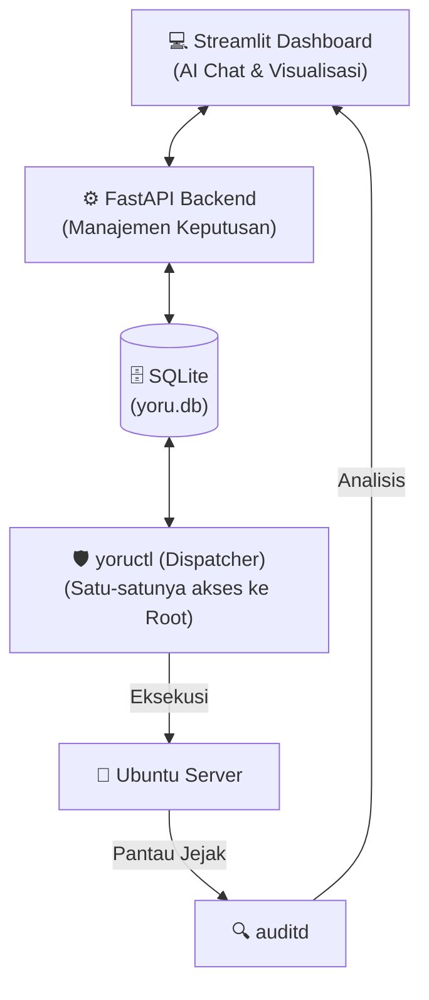

<div align="center">
  
  <h1>Yoru: AI DevSecOps Agent</h1>
  <p><i>Server kamu tidur. Yoru nggak. Melindungi VPS UMKM & Indie Hackers 24/7.</i></p>
  <p>🏆 <b>Proyek ini dibuat untuk Hackathon 2026</b> 🏆</p>
</div>

---

## 🚨 Masalah yang Kami Pecahkan (The Problem)

Sebagai Indie Hackers dan pemilik UMKM, mendeploy aplikasi ke VPS (Virtual Private Server) adalah hal biasa. **Tapi mengamankannya? Itu cerita lain.** 

1. **Serangan Hitungan Menit:** Begitu VPS menyala, botnet global langsung memindai celah keamanan (brute force SSH, port database yang terbuka).
2. **Keterbatasan Skill:** Konfigurasi *Firewall*, *Auditd*, dan *Sysctl Linux* terlalu rumit dan teknis bagi developer yang hanya ingin fokus ngoding produknya.
3. **Hasilnya:** Banyak server dibiarkan dengan setelan pabrik, mengundang peretas dan *Ransomware* yang bisa menghancurkan bisnis dalam semalam.

## 💡 Solusi Kami (The Solution)

**Yoru** hadir sebagai AI Agent yang mengambil alih pekerjaan IT Security (DevSecOps) Anda. Yoru secara otomatis memeriksa keamanan server berstandar **CIS Ubuntu 24.04**, mendeteksi perubahan ilegal, dan menyajikannya dalam **Dashboard Interaktif berbasis AI**.

Bintang utamanya adalah **Hermes**, asisten AI cerdas di dalam dashboard yang siap menerjemahkan log bahasa mesin (Linux auditd) yang ribet menjadi peringatan bahasa manusia yang mudah dipahami.

---

## ✨ Fitur Unggulan (The "Wow" Factor)

- 🤖 **Hermes Copilot:** Chatbot AI di dashboard Anda! Tidak mengerti kenapa port 3306 berbahaya? Cukup *chat* Hermes, dan ia akan menjelaskannya layaknya pakar *cybersecurity*.
- 📊 **Real-time Security Score:** Visualisasi metrik keamanan (0-100) dan kondisi server yang di-update setiap kali siklus penjagaan selesai.
- ❤️ **Tinder for SecOps (Action Center):** Mendeteksi *Drift* (perubahan konfigurasi tanpa izin). Yoru tidak main hapus, melainkan menyajikan "kartu kasus". Anda tinggal klik **"Setuju, amankan"** atau **"Tolak"**.
- 🛡️ **Katalog Standar CIS:** Mengimplementasikan 10 aturan emas (K01-K10) seperti mematikan login root, enforcing SSH Key, hingga manajemen Firewall UFW otomatis.

---

## 🏗️ Arsitektur & Teknologi (Tech Stack)



- **Frontend/Dashboard:** Python, Streamlit, Pandas, Plotly.
- **Backend/API:** Python, FastAPI, SQLite (One-way communication untuk keamanan maksimal).
- **Core Security Agent:** Bash, Linux Systemd, Auditd, UFW, SSH Daemon.

---

## 🚀 Cara Menjalankan Prototipe Secara Lokal (Demo)

Juri atau penguji dapat menjalankan dashboard Yoru di komputer lokal dengan cara berikut:

1. **Kloning Repositori:**
   ```bash
   git clone https://github.com/indri007/YORU.git
   cd YORU/web
   ```

2. **Buat Virtual Environment & Install Dependensi:**
   ```bash
   python3 -m venv venv
   source venv/bin/activate
   pip install -r requirements.txt
   ```

3. **Jalankan Dashboard Streamlit:**
   ```bash
   streamlit run streamlit_app.py
   ```
   *Dashboard akan terbuka di browser Anda pada `http://localhost:8501`*

---

## 🤝 Tim Kami

Kami adalah tim yang percaya bahwa keamanan level enterprise berhak dimiliki oleh semua kalangan, termasuk UMKM yang tidak punya dana untuk menyewa tim keamanan khusus.

*Dibuat dengan ❤️ dan ☕ untuk Hackathon 2026.*
