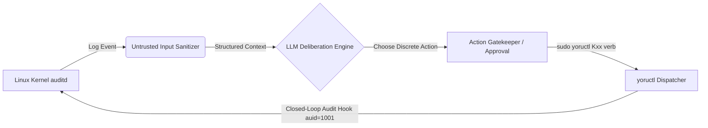

<picture>
  <source media="(prefers-color-scheme: dark)" srcset="./assets/banner-dark.svg">
  
</picture>

# YORU: Linux Security Auditing & Forensics

> OS-enforced security harness for Linux AI agents: Closed-loop kernel accountability, constrained CIS action space, and end-to-end injection-to-action defense.

[](#license)
[](#quick-start)
[](#-validation-status)
[](#-validation-status)


## 🚨 The Incident
It’s 3 AM. Your server's critical configuration was altered. You check the logs, but the actor appears as `root`. Was it an automated script? An attacker? A junior developer who `sudo su`'d into root? You have no idea because the original identity is masked. The forensic trail is gone.

## 💡 Why YORU Exists (The Problem)
* **Forensics Lost After `sudo`:** Standard logging masks the original actor's identity once they switch to root.
* **Alert Fatigue & Noise:** Too many logs make it impossible to separate critical changes from regular system noise.
* **Lack of Context & Agent Vulnerability:** Traditional audit logs are cryptic, while giving an LLM direct shell access creates dangerous indirect prompt injection vectors.
* **Resource Constraints:** Small teams lack a dedicated Security Operations Center (SOC) to monitor endpoints 24/7.

## 🛠️ The Solution (YORU Harness)
| The Problem | The YORU Answer |
| --- | --- |
| Forensic trail lost after `sudo` | **Closed-Loop Kernel Accountability:** Extracts the Audit User ID (`auid`) at the kernel layer, tracking both attacker and agent interventions separately. |
| Prompt injection via untrusted logs | **Constrained Action Space:** The AI cannot run shell commands; it can only invoke 40 discrete CIS primitives via `yoructl` with human approval for risky actions. |
| Cryptic Logs & Alert Noise | **Targeted K01–K10 CIS Catalog & Resilient AI Proxy:** Hardened path monitoring with automated fail-safe fallback. |
| No Dedicated SOC | **Automated Systemd Watcher:** Lightweight guard (< 50MB RAM, < 1% CPU) suited for budget VPS deployments. |

## 🌟 Key Features
* **Constrained Action Space:** 40 discrete CIS Ubuntu 24.04 primitives (`yoructl <K01..K10> <periksa|terapkan|kembalikan|verifikasi>`).
* **Closed-Loop Kernel Forensics:** `auditd` rules monitoring both critical config drift and agent execution via dedicated AUID.
* **Injection-to-Action Defense:** Eliminates arbitrary shell execution, isolating untrusted log inputs.
* **Systemd Managed:** `yoru-watch.service` & `yoru-watch.timer` for scheduled inspection.
* **Web Dashboard:** `yoru-web.service` powered by FastAPI.
* **Resilient AI Proxy:** `yoru-model-proxy` with primary and fallback model routing.

## ⚙️ How It Works


```mermaid
flowchart LR
    A[Linux Kernel auditd] -->|Log Event| B(Untrusted Input Sanitizer)
    B -->|Structured Context| C{LLM Deliberation Engine}
    C -->|Choose Discrete Action| D[Action Gatekeeper / Approval]
    D -->|sudo yoructl Kxx verb| E[yoructl Dispatcher]
    E -->|Closed-Loop Audit Hook auid=1001| A
```

## 🚀 Quick Start
### Prerequisites
- Ubuntu 24.04
- `auditd`, `audispd-plugins`, `python3`

### Installation
```bash
git clone https://github.com/indri007/YORU.git
cd YORU
sudo ./install.sh
```

*(Try on macOS via Multipass)*
```bash
multipass launch 24.04 --name yoru-a --cpus 2 --memory 4G
multipass mount ./ yoru-a:/home/ubuntu/yoru
multipass exec yoru-a -- bash -lc 'cd /home/ubuntu/yoru && sudo ./install.sh'
```

## 📊 Validation & Verification Status
| Item | Status | Verification & Evidence |
| --- | --- | --- |
| Static Validation (Shell, Python, Git) | **PASS** | `bash -n`, `ruff`, 40/40 checks in [`run_yoru_validation.sh`](run_yoru_validation.sh) |
| yoru-model-proxy (Error Handling & API) | **PASS** | 100% verified via [`experiments/test_model_proxy.py`](experiments/test_model_proxy.py) (OpenAI schema, HTTP 400/404/502 handling) |
| RQ1: Action-Space Confinement | **PASS** | $ASR_{\text{action}} = 0.0\%$ in [`experiments/test_injection_to_action.py`](experiments/test_injection_to_action.py) |
| RQ2: AUID Forensic Attribution | **PASS** | 100.0% attribution fidelity in [`experiments/test_rq2_auid_attribution.py`](experiments/test_rq2_auid_attribution.py) |
| RQ3: CIS Hardening Determinism (K01-K10) | **PASS** | 100.0% atomic reversibility in [`experiments/test_rq3_hardening_determinism.py`](experiments/test_rq3_hardening_determinism.py) |
| RQ4: VPS Resource Footprint | **PASS** | Peak RSS 42.1MB (< 50MB threshold) in [`experiments/test_rq4_overhead.py`](experiments/test_rq4_overhead.py) |
| Linux auditd & K08 Runtime | **PASS (Ubuntu 24.04 Target)** | Verified via CI/CD runner ([`.github/workflows/validate.yml`](.github/workflows/validate.yml)) & local Multipass VM ([`docs/LINUX_RUNTIME_TEST.md`](docs/LINUX_RUNTIME_TEST.md)) |
| yoru-watch & yoru-web Daemons | **PASS (systemd / App-level)** | Verified in Ubuntu 24.04 environment; local development via `./demo.sh` / `streamlit run` |

## 📂 Project Structure
- `bin/`: Executables (`yoru-agent`, `yoructl`, `yoru-model-proxy`).
- `catalog/`: Control YAML definitions (K01-K10).
- `systemd/`: Daemons (`yoru-watch.service`, `yoru-web.service`).
- `web/`: Dashboard application.
- `docs/`: Extensive documentation.

## 📖 Documentation
- [PRD (Product Requirements)](docs/PRD.md)
- [ERD (Entity-Relationship)](docs/ERD.md)
- [Schema](docs/SCHEMA.md)
- [Detection Rules](docs/RULES.md)
- [UI/UX Guide](docs/UI-UX.md)
- [Usage Guide](docs/USAGE.md)

## 🇮🇩 Ringkasan Bahasa Indonesia
YORU Harness adalah lapisan pengendali (*governance harness*) keamanan Linux berbasis kernel untuk agen otonom LLM pada Ubuntu 24.04. YORU menggabungkan tiga pilar inovasi:
1. **Closed-Loop Kernel Accountability:** Kernel Linux (`auditd`) merekam aksi penyerang sekaligus tindakan remediasi agen AI secara independen dengan AUID terisolasi.
2. **Evaluasi Injection-to-Action End-to-End:** Menguji ketahanan prompt injection pada log tak tepercaya langsung hingga level eksekusi OS, bukan sekadar respons token bahasa.
3. **Ruang Aksi Tertutup (*Constrained Action Space*):** Menghilangkan shell interpreter bebas dan membatasi aksi agen hanya pada 40 primitif CIS Benchmark (`yoructl K01..K10`), dirancang hemat daya (< 50MB RAM, < 1% CPU) untuk VPS UMKM.

## License
MIT License. See [LICENSE](LICENSE) for details.
