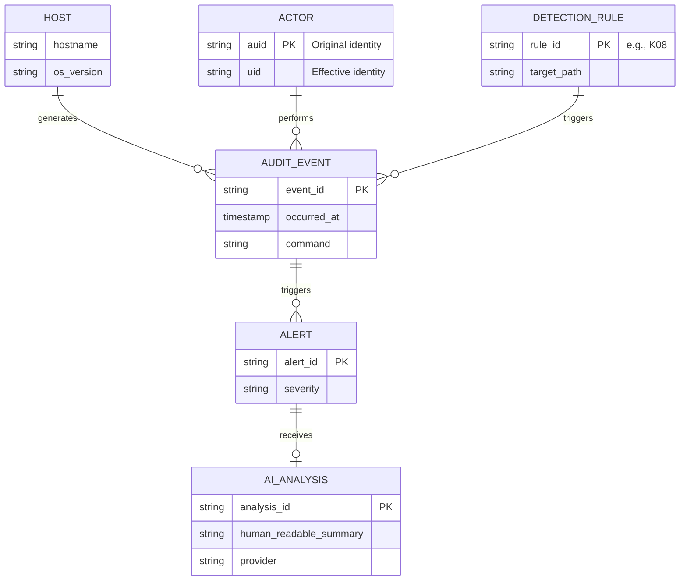

# Entity-Relationship Diagram (ERD)

```mermaid
erDiagram
    HOST ||--o{ AUDIT_EVENT : generates
    HOST {
        string hostname
        string os_version
    }
    
    ACTOR ||--o{ AUDIT_EVENT : performs
    ACTOR {
        string auid PK "Original identity"
        string uid "Effective identity"
    }

    DETECTION_RULE ||--o{ AUDIT_EVENT : triggers
    DETECTION_RULE {
        string rule_id PK "e.g., K08"
        string target_path
    }

    AUDIT_EVENT ||--o{ ALERT : triggers
    AUDIT_EVENT {
        string event_id PK
        timestamp occurred_at
        string command
    }

    ALERT ||--o| AI_ANALYSIS : receives
    ALERT {
        string alert_id PK
        string severity
    }
    
    AI_ANALYSIS {
        string analysis_id PK
        string human_readable_summary
        string provider
    }
```

*Note: The events and alerts are logically stored as JSON logs and parsed by the dashboard, rather than existing in a traditional relational database.*
